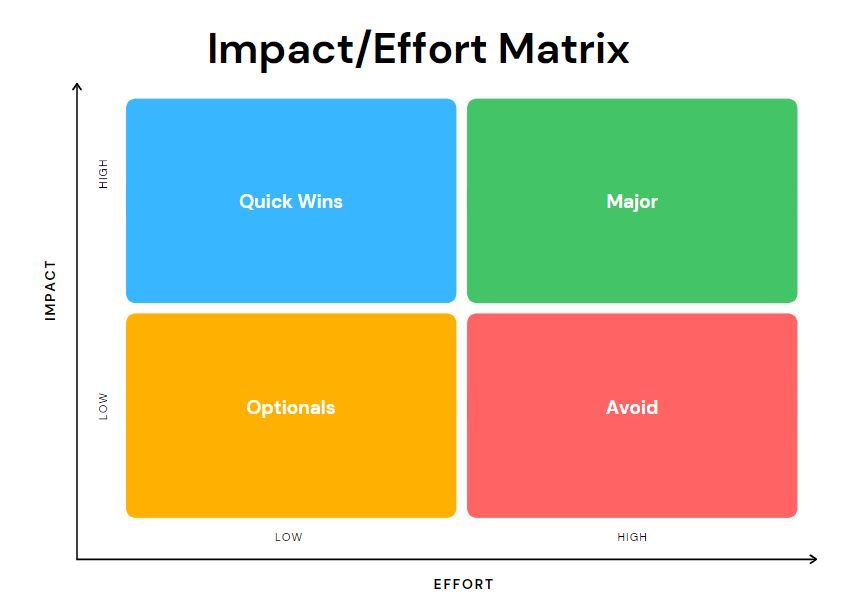
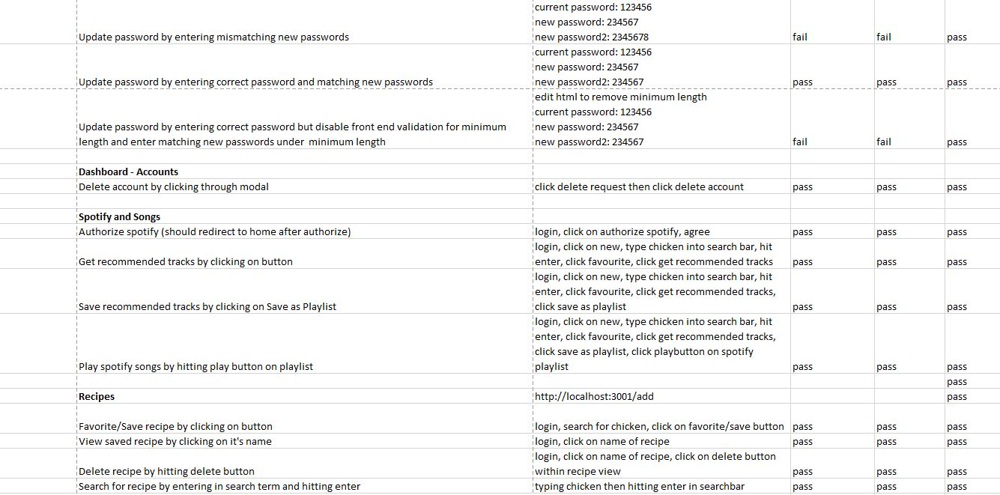
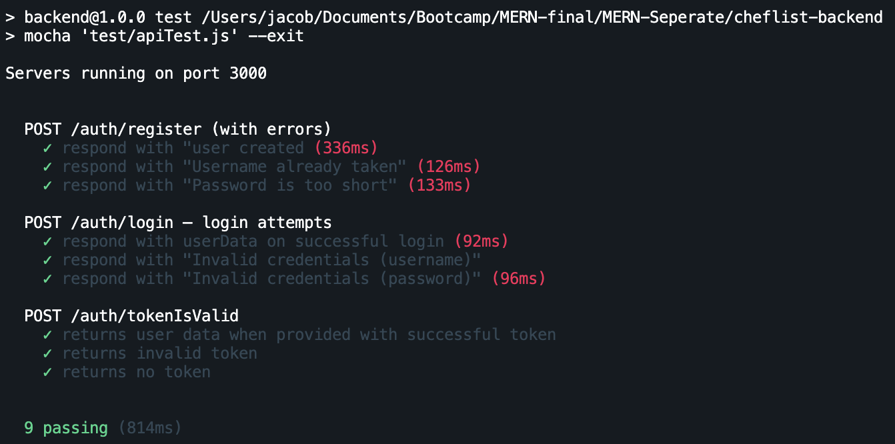
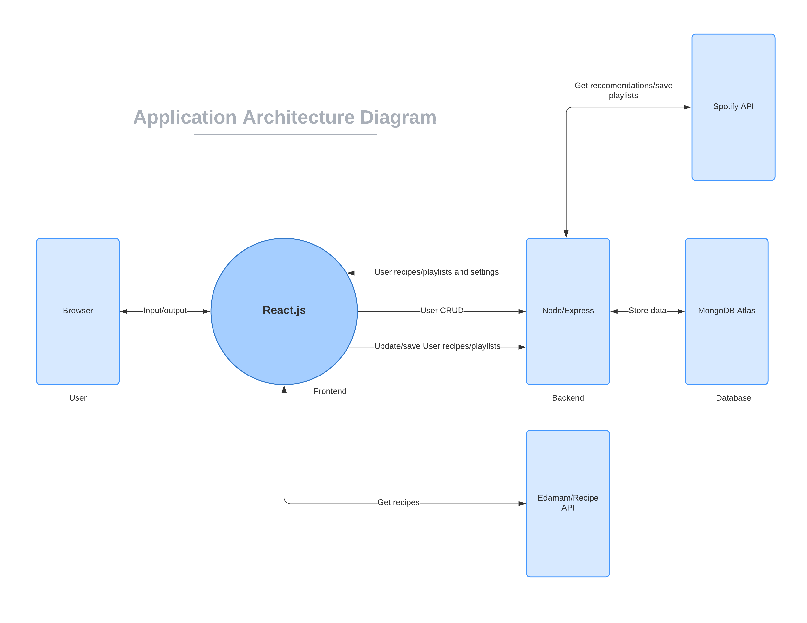
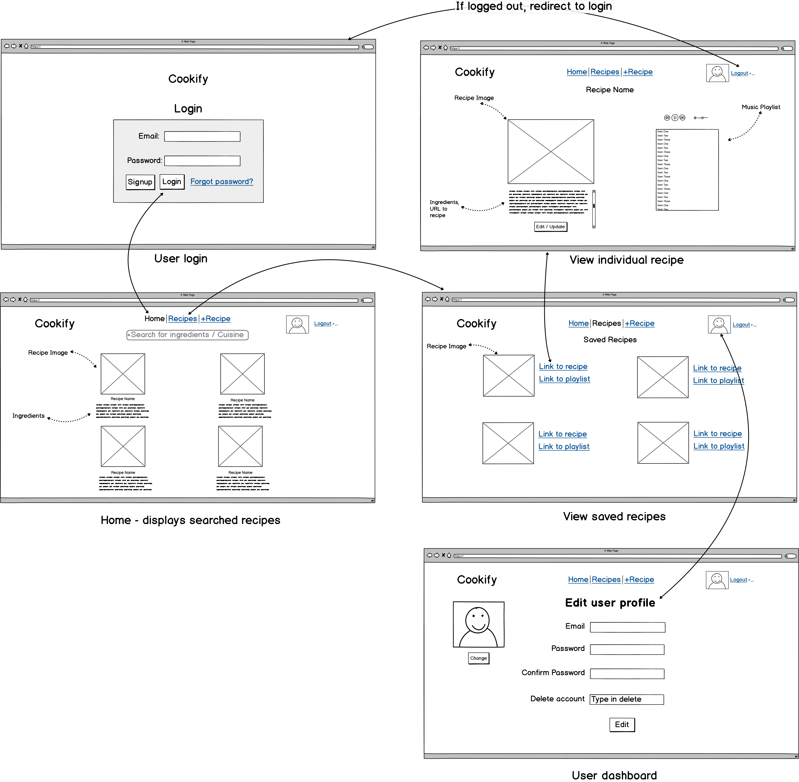
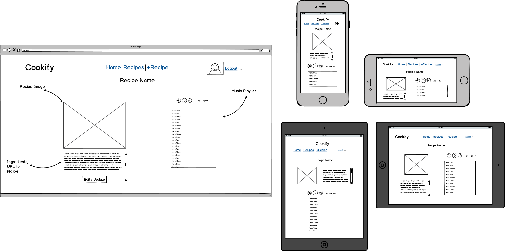
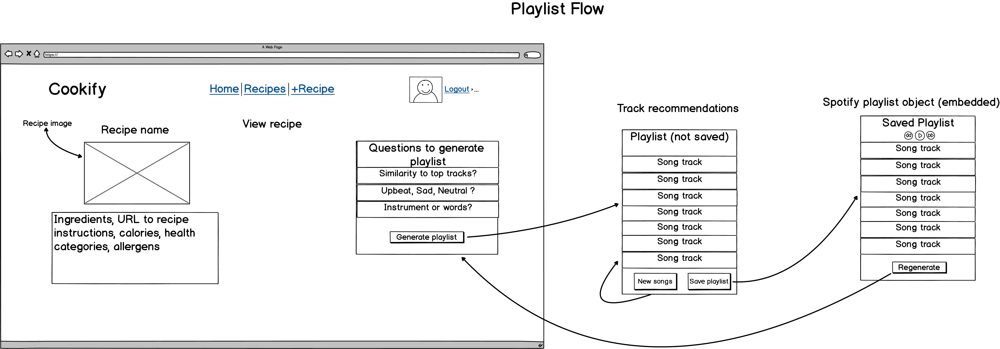
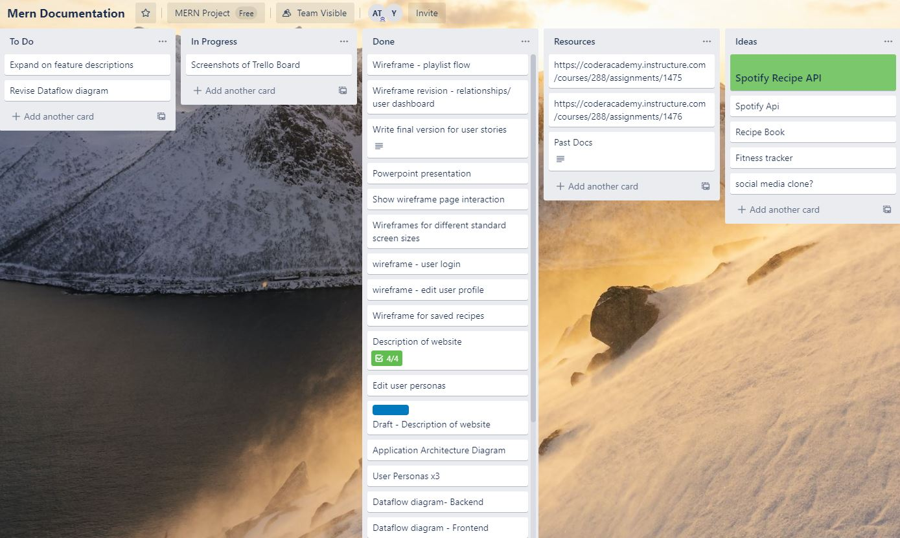

# Cheflist

# MERN-docs-T3A2

Link to deployed website: https://cheflist.netlify.app/login

Links to deployment repos:  
Front-end: https://github.com/yeddyfit/cheflist-frontend  
Back-end: https://github.com/yeddyfit/cheflist-backend

Link to original repo: https://github.com/yeddyfit/MERN-proj

Note that the above github repo contains most of our commits and branches before deployment.
The below, deployment repositories, were created just before our first deployment and will contain commits and branches specific to after deploying.

### Description

Website/app that lets you search recipes by key ingredients. After selecting a recipe a playlist relevant to the recipe will be generated, this can be saved to the user account.
The user will be asked some questions to gauge mood and disposition, this will help the playlist generator in creating a playlist that is relevant and engaging. The recipes and playlists are saved securely on the site so that they can be accessed at any time.

 

## T3A2 - Part B

### R3 Project Management Methodology

Our project's tasks were placed on a Trello board under the Kanban methodology, we initially split tasks into a simple green and yellow coloring system where green was back-end tasks and yellow was front-end. This wasn't very effective and we later progressed to an action-priority matrix that color coded tasks according to where they sat on a graph of impact versus effort required. This allowed us to quickly figure out what we needed to do and what we could ignore.

Regarding git/source control, once we had the bas structure of the app down, we followed a pretty simplified version of a git branching model. This essentially involved master branch only being pushed to when a feature was completed, and bug-tested. We generally had a branch called devlop, that we would merge into master. On both the backend and frontend we had branches for bug-fixes and testing, as a well as feature specific branches. These would generally merge into the develop branch before being merged into master. This helped us to minimise bugs/errors and merge conflicts, as well as easily abandon something that was not working as it should.

We also had a discussion on where our strengths and weaknesses lay. Jacob felt comfortable
with the backend and had extensive experience with the spotify api and callbacks through side projects. Andrew had less experience with a MERN backend but had created a recipe app using React during a side project. Both of our weaknesses were front-end styling.

We were also a 2-person team which meant there was a larger workload but that communication and delegation of tasks would be easier.

Pictured below is how we constructed our action priority matrix

 

Pictured below are two screenshots of our kanban in practice:

29th July

30th July

 

### R4 Task Delegation Methodology

Task delegation for the initial stages of the project were not clear-cut but this wasn't detrimental to us, we utilized a mixture of pair-programming and consulted with each other when issues arose. Tasks were broken down into smaller sub-tasks, which we could quickly complete. Constant communication also allowed us to actively prioritize important tasks and progress quickly.

Since we were a smaller team and were both proactive, we would simply pick the tasks we wanted to do and assign our tags to them, the tags can be seen to the bottom right of our trello cards. Understandably this may not work for other teams and requires a degree of trust and proactiveness.

 

### R8 Testing

We also used cypress to test the front end, our cypress tests can be found here: https://github.com/yeddyfit/cheflist-frontend/tree/master/cypress/integration

Tests were created for standard functionality such as logins, changing passwords/usernames, adding and deleting recipes, registering accounts and a basic userflow of a user logging in, adding a recipe and generating a playlist to attach to that recipe.

Manual testing was done on the the development and production site, this was done on an excel spreadsheet and allowed us to systematically test each feature of the website and ensured we didn't miss anything.

Displayed below is our manual testing sheet

Backend testing was done using mocha and supertest. These only tested the auth routes including whether we're receiving back the correct error. They can by calling `npm test` and can be found in the folder labelled 'test'. Screenshots of the results are shown below.

 

### Libraries

#### Front end & Back end

- **axios** - used to handle http requests for browser and node.js, returns a promise.

#### Front end

- **@testing-library/react** - provides a set of helpers for testing React components, allows you to test DOM nodes instead of instances of React components. Used in conjunction with cypress for testing.

- **cypress** - Javascript-based, front end testing framework used to run tests on browsers. Can be used to run end-to-end, integration and unit tests.

- **react-dom** - allows us to render React components onto the DOM and handles updating these components.

- **react** - javascript library for UI interfaces, typically used in conjuction with react-dom.

- **react-loader-spinner** - provides a loading spinner for us to implement during async operations where we're waiting for data to load.

- **react-router-dom** - used for routing and declaring valid routes and links. Also gives us access to hooks such as useHistory to enable easier navigation of a website.

- **react-transition-group** - used to apply transitions to modals.

- **uuid** - used to create universally unique identifiers, which we can use as element keys.

#### Back end

- **bcryptjs** - provides ability to encrpyt, decrypt and compare passwords.

- **cors** - allows for cross-origin resource sharing, allowing our frontend to request resources from our backend despite coming from a different origin.

- **dotenv** - makes .env files in our root folder accesible with the `process.env` call.

- **express** - a node web framework that simplifies the process of setting up server side api routing.

- **jsonwebtoken** - used to implement json web tokens. Allows us to sign, decode and set expiry times for tokens.

- **mocha** - a JavaScript test framework can run on Node.js and the browser, which we used to test our express auth/login paths.

- **mongoose** - a package that lets us interface with our MongoDB database using node. It is formally know as an Object Data Modelling library, and is the middlemen between Our code and our MongoDb database object representations.

- **nodemon** - uesd to automatically refresh the node application when files changes are saved.

- **supertest** - used for testing HTTP requests by providing abstraction, used in conjunction with mocha.

   

## T3A2 - Part A

### R1 Overview

#### Description:

Website/app will allow cooks to view and search recipes by key ingredients. After selecting a recipe a playlist relevant to the recipe will be generated, this can be saved to the user account.
The cook will be asked some questions to gauge mood and disposition, this will help the playlist generator in creating a playlist that is relevant and engaging. The recipes and playlists are saved securely on the site so that they can be accessed at any time.

#### Purpose

Helping cooks discover new music and also enriching the cooking experience with highly engaging music that is specific to a cook's mood, cuisine and attitude. It is intended as a website to complement the cooking process, where you can both search for a recipe and then have a spotify playlist built around it.

#### Functionality/Features

- Can create a user account (user registration)
- Can edit account details
- Can delete account
- Stores user data on the backend in a secure way
- Can find recipes by ingredients
- Can add/save recipes to user account
- Can edit or delete saved recipes
- Can generate a spotify playlist based on a recipe
- Can answer questions to help curate playlist
- Can play music through site

#### Target Audience

Our target audience is anyone looking to listen to music while they cook. It is for people with a Spotify account who are looking to find a recipe to cook by ingredients, and then listen to a Spotify playlist that is tailored to the recipe chosen. Anyone can, however, use our website to explore the capabilities of the playlist generator to produce relevant soundtracks based on user input.

#### Teck Stack

**Back end:**

- **Express.js** - web application framework for Node.js
- **Node.js** - asynchronous JavaScript runtime, allows us to run JavaScript outside of a browser
- **MongoDB Atlas** - NoSQL document-oriented, cloud-based database
- **Heroku** - hosting for back-end of application
- **Backend libraries include:** SpotifyWebAPI, jsonwebtoken, bcryptjs, mocha, and mongoose

**Front end:**

- **Netlify** - web hosting for front-end of application
- **Spotify API** - used to retrieve songs and playlists
- **Spoonacular API** - used to retrieve recipes and additonal data regarding those recipes

---

### Libraries (PART B)

#### Front end & Back end

- **axios** - used to handle http requests for browser and node.js, returns a promise.

#### Front end

- **@testing-library/react** - provides a set of helpers for testing React components, allows you to test DOM nodes instead of instances of React components. Used in conjunction with cypress for testing.

- **cypress** - Javascript-based, front end testing framework used to run tests on browsers. Can be used to run end-to-end, integration and unit tests.

- **react-dom** - allows us to render React components onto the DOM and handles updating these components.

- **react** - javascript library for UI interfaces, typically used in conjuction with react-dom.

- **react-loader-spinner** - provides a loading spinner for us to implement during async operations where we're waiting for data to load.

- **react-router-dom** - used for routing and declaring valid routes and links. Also gives us access to hooks such as useHistory to enable easier navigation of a website.

- **react-transition-group** - used to apply transitions to modals.

- **uuid** - used to create universally unique identifiers, which we can use as element keys.

#### Back end

- **bcryptjs** - provides ability to encrpyt, decrypt and compare passwords.

- **cors** - allows for cross-origin resource sharing, allowing our frontend to request resources from our backend despite coming from a different origin.

- **dotenv** - makes .env files in our root folder accesible with the `process.env` call.

- **express** - a node web framework that simplifies the process of setting up server side api routing.

- **jsonwebtoken** - used to implement json web tokens. Allows us to sign, decode and set expiry times for tokens.

- **mocha** - a JavaScript test framework can run on Node.js and the browser, which we used to test our express auth/login paths.

- **mongoose** - a package that lets us interface with our MongoDB database using node. It is formally know as an Object Data Modelling library, and is the middlemen between Our code and our MongoDb database object representations.

- **nodemon** - uesd to automatically refresh the node application when files changes are saved.

- **supertest** - used for testing HTTP requests by providing abstraction, used in conjunction with mocha.

### R2 Dataflow Diagram

---

### R3 Application Architecture Diagram

---

### R4 User Stories

- As a user I want to be able to create an account and login
- As a user I want to be able to edit my details
- As a user I want to be able to delete my account
- As a user I want to be able to logout at any time
- As a user I want my spotify credentials to be stored securely

- As a user I want to be able to search for recipes by key ingredients
- As a user I want to be able to save recipes and view them later
- As a user I want to be able to generate a music playlist based on my disposition
- As a user I want to be able to view a playlist relevant to my selected recipe
- As a user I want to be able to sort through my recipes by cuisine or ingredient.

- As a user I want to be able to play my music through the site.
- As a user I want to be able to save playlists and view them later

### User Personas

Our user stories were initially quite difficult to pinpoint as our website relies mainly on users having spotify accounts and to be actively using those accounts. Research on Spotify reveals that it's demographic is largely on the younger side with over 50% of it's users being under 34. Further research revealed that it's 3rd biggest demogrpahic was the 55+ age group, having information regarding spotify's user market helped us to develop and refine our user stories.

We focused mainly on the union of cooking and music, users who enjoyed both would get the most value out of our website.

- Margarita, recently retired, 56, looking to try and cook more exotic dishes. Margarita wants to cook different cuisines and also enjoys the idea of listening to music that comes from the same country as the cuisine.

- Rose, artist, 32, loves experimenting with new ideas, she's always trying to find inspiration for her art. Rose's friend recently recommended her a website that mixes her music and cooking. Intrigued by the idea of finding inspiration from diverse music tracks, she signs up.

- Mary, cooking teacher, 30, hoping to have her highschool students more engaged in class, Mary has signed up for the website and lets her students take turns to help generate a playlist for the recipe that she'll be instructing them to cook.

- Joe, a student, 22, likes to cook on occasion and loves music, wants to find recipes based on what ingredients he has on hand, and wants to also listen to the perfect playlist while cooking/eating.

- George, a web developer, 28, has recently begun venturing out of his comfort zone to try new things. He recently found a weird website that generates playlists for recipes, curious as to how good the recommendations might be, he decided he'd give it a go and see what kind of music it recommends.

Reference

- https://1z1euk35x7oy36s8we4dr6lo-wpengine.netdna-ssl.com/wp-content/uploads/2018/11/Spotify-demographics.png
- https://www.businessofapps.com/data/spotify-statistics/

---

### R5 Wireframes

Relations betweens screens

User login

Home page

Saved recipes

Edit user profile

View recipes

Flow of playlist re-rendering

---

### R6 Planning

The planning for the project was mainly done through Trello and the use of Kanban methodology. This helped us quickly visualize what needed to be done on any given day and whether there were any outstanding tasks. Screenshots are provided below of this process as we refined what had to be done and completed the tasks.

10th July

13th July

14th July - Below trello board was for the coding requirements of the project

16th July

19th July

---
