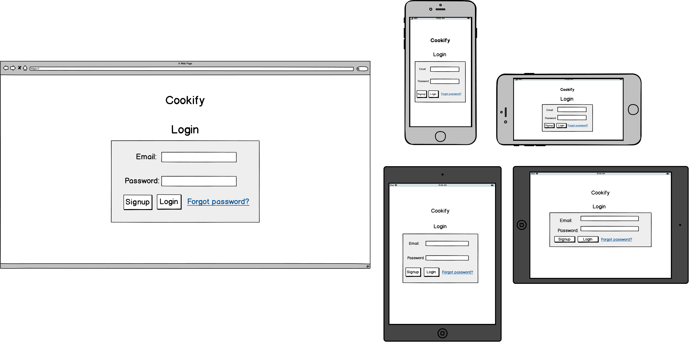
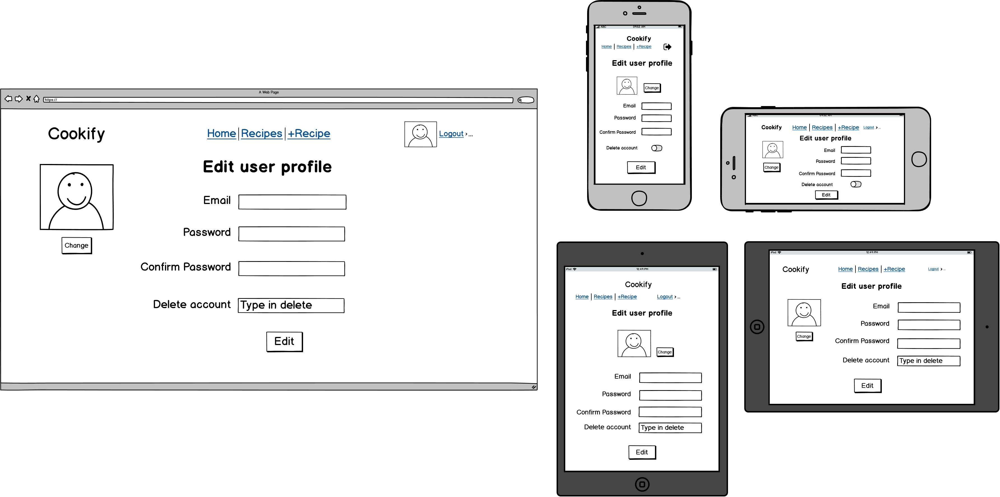

# Cookify

# MERN-docs-T3A2

Link to deployed website: ######
Link to Github repo: ######

### R1 Overview

#### Description:
Website/app will allow cooks to view and search recipes by key ingredients. After selecting a recipe a playlist relevant to the recipe will be generated, this can be saved to the user account. 
The cook will be asked some questions to gauge mood and disposition, this will help the playlist generator in creating a playlist that is relevant and engaging. The recipes and playlists are saved securely on the site so that they can be accessed at any time.

#### Purpose
Helping cooks discover new music and also enriching the cooking experience with highly engaging music that is specific to a cook's mood, cuisine and attitude. It is intended as a website to complement the cooking process, where you can both search for a recipe and then have a spotify playlist built around it.

#### Functionality/Features
- Can create a user account (user registration)
- Can edit account details
- Can delete account
- Stores user data on the backend in a secure way
- Can find recipes by ingredients
- Can add/save recipes to user account
- Can edit or delete saved recipes
- Can generate a spotify playlist based on a recipe
- Can answer questions to help curate playlist
- Can play music through site

#### Target Audience
Our target audience is anyone looking to listen to music while they cook. It is for people with a Spotify account who are looking to find a recipe to cook by ingredients, and then listen to a Spotify playlist that is tailored to the recipe chosen. Anyone can, however, use our website to explore the capabilities of the playlist generator to produce relevant soundtracks based on user input.
 

#### Teck Stack
Back end:
- Express.js - web application framework for Node.js
- Node.js - asynchronous JavaScript runtime, allows us to run JavaScript outside of a browser
- MongoDB Atlas - NoSQL document-oriented, cloud-based database
- Backend libraries include: SpotifyWebAPI, jsonwebtoken, bcryptjs, mocha, and mongoose

Front end:
- React.js - javascript library for UI interfaces
- Axios - used to get fetch requests
- React-router-dom - used for routing
- Cypress - end to end testing framework

- Netlify - web hosting
- Spotify API - used to retrieve songs and playlists
- Edamam API - used to retrieve recipes and nutritional info
- React Bootstrap - used to style components 

---

### R2 Dataflow Diagram

---

### R3 Application Architecture Diagram

---

### R4 User Stories
- As a user I want to be able to create an account and login
- As a user I want to be able to edit my details
- As a user I want to be able to delete my account
- As a user I want to be able to logout at any time
- As a user I want my spotify credentials to be stored securely

- As a user I want to be able to search for recipes by key ingredients
- As a user I want to be able to save recipes and view them later
- As a user I want to be able to generate a music playlist based on my disposition
- As a user I want to be able to view a playlist relevant to my selected recipe
- As a user I want to be able to sort through my recipes by cuisine or ingredient.

- As a user I want to be able to play my music through the site.
- As a user I want to be able to save playlists and view them later

### User Personas

Our user stories were initially quite difficult to pinpoint as our website relies mainly on users having spotify accounts and to be actively using those accounts. Research on Spotify reveals that it's demographic is largely on the younger side with over 50% of it's users being under 34. Further research revealed that it's 3rd biggest demogrpahic was the 55+ age group, having information regarding spotify's user market helped us to develop and refine our user stories. 

We focused mainly on the union of cooking and music, users who enjoyed both would get the most value out of our website.

- Margarita, recently retired, 56, looking to try and cook more exotic dishes. Margarita wants to cook different cuisines and also enjoys the idea of listening to music that comes from the same country as the cuisine.

- Rose, artist, 32, loves experimenting with new ideas, she's always trying to find inspiration for her art. Rose's friend recently recommended her a website that mixes her music and cooking. Intrigued by the idea of finding inspiration from diverse music tracks, she signs up.

- Mary, cooking teacher, 30, hoping to have her highschool students more engaged in class, Mary has signed up for the website and lets her students take turns to help generate a playlist for the recipe that she'll be instructing them to cook.

- Joe, a student, 22, likes to cook on occasion and loves music, wants to find recipes based on what ingredients he has on hand, and wants to also listen to the perfect playlist while cooking/eating.

- George, a web developer, 28, has recently begun venturing out of his comfort zone to try new things. He recently found a weird website that generates playlists for recipes, curious as to how good the recommendations might be, he decided he'd give it a go and see what kind of music it recommends.

Reference
- https://1z1euk35x7oy36s8we4dr6lo-wpengine.netdna-ssl.com/wp-content/uploads/2018/11/Spotify-demographics.png
- https://www.businessofapps.com/data/spotify-statistics/

---

### R5 Wireframes
Relations betweens screens

User login

Home page

Saved recipes

Edit user profile

View recipes

Flow of playlist re-rendering

---

### R6 Planning

The planning for the project was mainly done through Trello and the use of Kanban methodology. This helped us quickly visualize what needed to be done on any given day and whether there were any outstanding tasks. Screenshots are provided below of this process as we refined what had to be done and completed the tasks.

10th July

13th July

14th July - Below trello board was for the coding requirements of the project

16th July 

19th July
